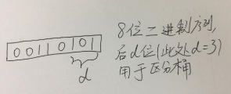
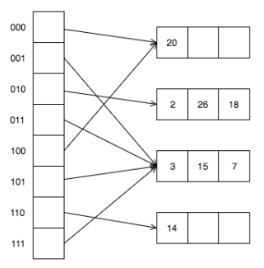

姓名：冯运
学号：1160300524

作业五：物理存储与查询优化

1. 考虑一个可扩展的Hash结构，其每个桶最多可以容纳两个记录。考虑按顺序插入8,16,4,3,11,12后的索引结构，且初始索引为空。且用低位表示桶的数目，即：全局深度为d时考虑的是Hash函数的最后d位。如：

(1)此时索引全局深度是多少？画出此时索引结构。
全局深度是3
索引结构如下:

(2)在上题索引基础上插入18。包括18的桶的深度是多少？画出此时的索引结构。
包括18的桶的深度是3

(3)考虑如下图所示可扩展Hash结构：

向其中按顺序插入28,30,4,8,34。哪一个值的插入引发第一次桶的分裂？哪一个值的插入导致全局深度第一次增加？
8的插入引发了第一次桶的分裂
34的插入引发了全局深度的第一次增加
2.
(1)把1-10插入到阶数为4和为8的空B+树中，并分别画出插入的最终结果。假设右子树中的值大于等于索引值，而左子树小于索引值。
(2)考虑如下B+树:

假设：右子树中的值大于等于索引值，而左子树小于索引值。当出现下溢，且可以从左右两个兄弟节点借元素，则优先选择右边的兄弟节点。
下面四题全部是以上图为基础，它们之间没有联系。
(a)增加元素10；
(b)增加元素10、18；
(c)删除元素11；
(d)删除元素31。
画出四种情况后的B+树。

3.考虑关系R1(A,B,C)，R2(C,D,E)，和R3(E,F)
(1)假设R1、R2、R3的主键分别是A、C、E。R1有1000个元组，R2有1500个元组，R3有750个元组，估计R1⋈R2⋈R3的大小，并给出一个这个连接操作的实现策略（简述）
(2)假定没有主键，V(C,R1)=900，V(C,R2)=1100，V(E,R2)=50，V(E, R3)=100。假设R1 有1000 个元组，R2 有1500 个元组，R3 有750 个元组，估计R1⋈R2⋈R3的大小，并给出一个这个连接操作的实现策略（简述）。


4.图书馆数据库有如下3个关系模式:
B(B#, Title, Author, Publisher)
S(S#, Name, Department)
L(S#, B#, Date)
其中B为图书信息表：B#为图书编号，Title 为书名，Author为作者，Publisher为出版社；S为学生信息表：S#为学号，Name为学生姓名，Department为学院名；L为借阅信息表：S#为借阅人学号，B#为被借阅图书编号，Date为借阅日期。
用户有一查询语句：
```sql
Select Name
From B, S, L
Where L.S#=S.S# and L. B#=B.B# and Title=”Jane Eyre”
```
检索借阅了书名为“Jane Eyre”的学生姓名。
求解下列问题:
a.写出以上SQL 语句所对应的关系代数表达式，并画出对应的逻辑查询计划树。使用启发式查询优化算法，对该逻辑查询计划树进行优化，并画出优化后的逻辑查询计划树。
b.设L表有10000条元组，B表有2000条元组，S表中有1000条元组，L表中满足借阅书名为“Jane Eyre”的元组数为50，计算优化前与优化后的查询计划中每一步所产生的中间结果大小。(要求写出具体计算过程)